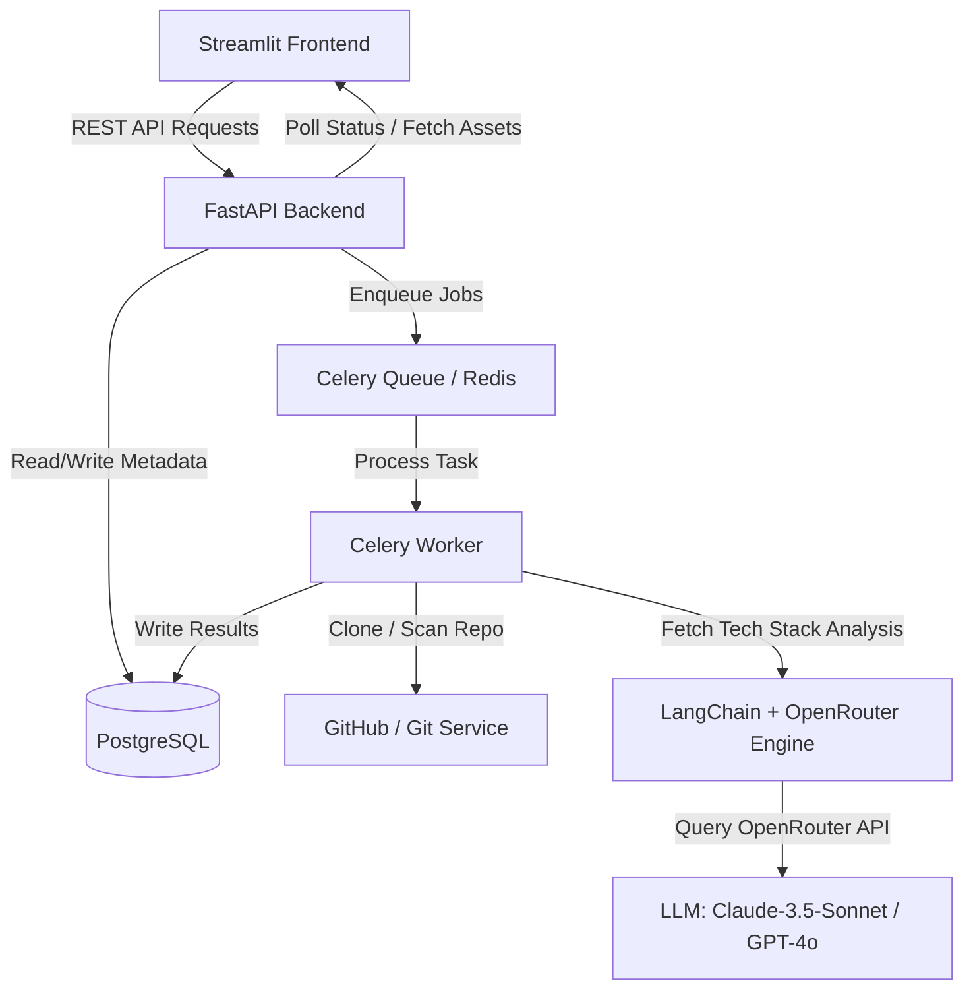
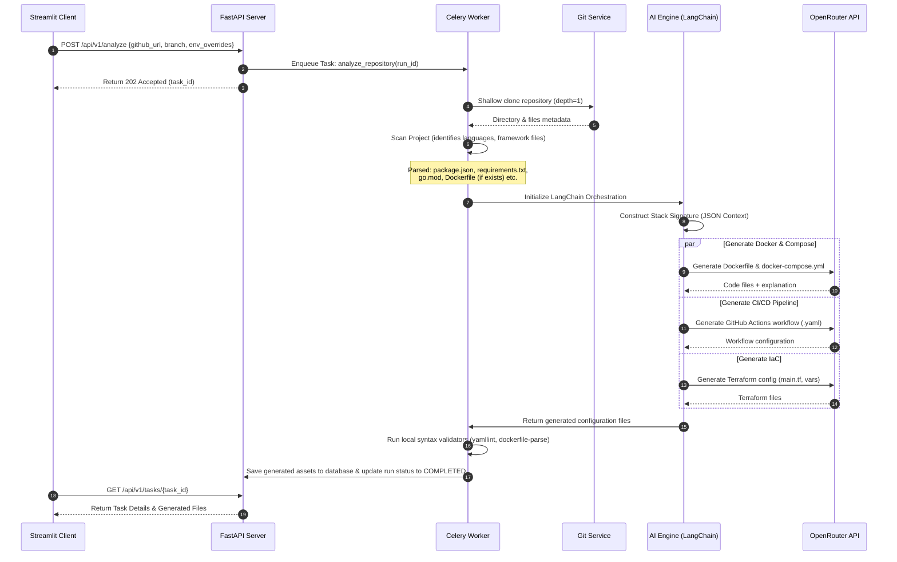
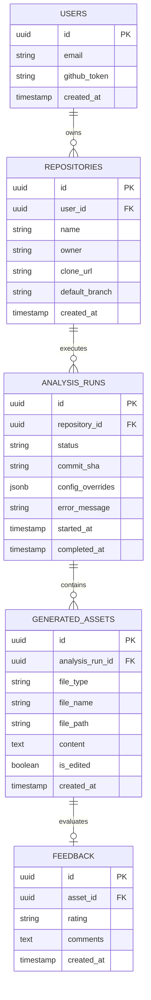

# CloudForge DevOps Architecture Design Document

This document outlines the system architecture, database schema, folder structure, API design, AI workflow, and MVP roadmap for **CloudForge DevOps**—a platform that analyzes GitHub repositories and automatically generates containerization, CI/CD, and Infrastructure-as-Code (IaC) configuration files.

---

## 1. High-Level System Architecture

CloudForge DevOps utilizes an asynchronous, event-driven pattern to handle repository scanning and LLM interactions without blocking the client.



### Components Summary
- **Frontend (Streamlit)**: A modern, responsive user interface allowing developers to submit repository URLs, configure runtime parameters, monitor generation status in real-time, view/edit generated files, and export changes.
- **Backend API (FastAPI)**: Lightweight, high-performance web API that handles user authentication, repository metadata, job submission, database interactions, and files CRUD operations.
- **Asynchronous Task Queue (Celery + Redis)**: Handles long-running clone and LLM generation tasks. Redis acts as the message broker and result backend.
- **AI Orchestration Layer (LangChain + OpenRouter)**: Responsible for project scanning (reading manifests, detecting structures), parsing dependencies, and constructing structured, context-rich LLM prompts to query models via OpenRouter (e.g., Anthropic Claude 3.5 Sonnet, OpenAI GPT-4o).
- **Persistence (PostgreSQL)**: Stores user details, repository metadata, historical runs, generated artifacts, and user feedback logs.

---

## 2. Backend Modules & AI Workflow

To scale code analysis efficiently within context limits, CloudForge DevOps uses a multi-tier **Ingestion & Generation Pipeline**:



### Detailed AI Workflow Steps
1. **Shallow Directory Scanner**: Recursively scans directory names and file structures up to a depth of 4 levels, creating a text-based folder tree.
2. **Signature Extractor**: Inspects known configuration files (e.g., `package.json`, `requirements.txt`, `pom.xml`, `go.mod`, `Cargo.toml`, `pyproject.toml`) to extract dependency names, node/python/go versions, and framework signatures (e.g., FastAPI, Express, Spring Boot, Next.js).
3. **Configuration & Port Resolver**: Scans main source code files (using simple regex rules or abstract syntax trees) to identify application port bindings and environment variables.
4. **Context Construction (The JSON Signature)**: Creates a normalized JSON descriptor of the codebase:
   ```json
   {
     "language": "Python",
     "framework": "FastAPI",
     "entrypoint": "app/main.py",
     "ports": [8000],
     "dependencies": ["sqlalchemy", "postgresql", "celery"],
     "has_db": true,
     "db_provider": "PostgreSQL"
   }
   ```
5. **Prompt Engine & Parallel Generation**:
   - **Dockerfile Chain**: Generates a multi-stage, production-grade, secure (non-root user) Dockerfile.
   - **Compose Chain**: Generates a `docker-compose.yml` linking the application container with its database, cache, or worker containers.
   - **CI/CD Chain**: Generates a lint, test, build, and push workflow using GitHub Actions.
   - **Terraform Chain**: Generates infrastructure definition files (target AWS, GCP, or Azure based on user settings).
6. **Validation Engine**: Automatically checks YAML formatting and validates instructions against best-practice rules (e.g., ensuring multi-stage builds are used in Docker, ensuring sensitive variables in Terraform are parameterized).

---

## 3. Database Schema

The PostgreSQL database manages user sessions, project analyses, and feedback mechanisms.



### Table Definitions (DML Drafts)
```sql
CREATE TYPE run_status AS ENUM ('PENDING', 'RUNNING', 'COMPLETED', 'FAILED');
CREATE TYPE asset_type AS ENUM ('DOCKERFILE', 'DOCKER_COMPOSE', 'GITHUB_ACTIONS', 'TERRAFORM', 'DEPLOYMENT_SUGGESTION');
CREATE TYPE feedback_rating AS ENUM ('HELPFUL', 'NEEDS_IMPROVEMENT', 'BROKEN');

CREATE TABLE users (
    id UUID PRIMARY KEY DEFAULT gen_random_uuid(),
    email VARCHAR(255) UNIQUE NOT NULL,
    github_token TEXT,
    created_at TIMESTAMP WITH TIME ZONE DEFAULT CURRENT_TIMESTAMP
);

CREATE TABLE repositories (
    id UUID PRIMARY KEY DEFAULT gen_random_uuid(),
    user_id UUID REFERENCES users(id) ON DELETE CASCADE,
    name VARCHAR(255) NOT NULL,
    owner VARCHAR(255) NOT NULL,
    clone_url TEXT NOT NULL,
    default_branch VARCHAR(100) DEFAULT 'main',
    created_at TIMESTAMP WITH TIME ZONE DEFAULT CURRENT_TIMESTAMP
);

CREATE TABLE analysis_runs (
    id UUID PRIMARY KEY DEFAULT gen_random_uuid(),
    repository_id UUID REFERENCES repositories(id) ON DELETE CASCADE,
    status run_status NOT NULL DEFAULT 'PENDING',
    commit_sha VARCHAR(40),
    config_overrides JSONB DEFAULT '{}',
    error_message TEXT,
    started_at TIMESTAMP WITH TIME ZONE DEFAULT CURRENT_TIMESTAMP,
    completed_at TIMESTAMP WITH TIME ZONE
);

CREATE TABLE generated_assets (
    id UUID PRIMARY KEY DEFAULT gen_random_uuid(),
    analysis_run_id UUID REFERENCES analysis_runs(id) ON DELETE CASCADE,
    file_type asset_type NOT NULL,
    file_name VARCHAR(255) NOT NULL,
    file_path VARCHAR(512) NOT NULL,
    content TEXT NOT NULL,
    is_edited BOOLEAN DEFAULT FALSE,
    created_at TIMESTAMP WITH TIME ZONE DEFAULT CURRENT_TIMESTAMP
);

CREATE TABLE feedback (
    id UUID PRIMARY KEY DEFAULT gen_random_uuid(),
    asset_id UUID REFERENCES generated_assets(id) ON DELETE CASCADE,
    rating feedback_rating NOT NULL,
    comments TEXT,
    created_at TIMESTAMP WITH TIME ZONE DEFAULT CURRENT_TIMESTAMP
);
```

---

## 4. API Design

Exposed at base URL `/api/v1`. All endpoints return JSON and handle errors with uniform HTTP exceptions.

| Method | Endpoint | Description | Request Body | Response Code & Object |
| :--- | :--- | :--- | :--- | :--- |
| **POST** | `/auth/login` | Github OAuth callback / User creation | `{ "code": "string" }` | `200 OK` `{ "token": "jwt_token" }` |
| **POST** | `/analyze` | Triggers a codebase scan | `{ "github_url": "url", "branch": "main", "overrides": {} }` | `202 Accepted` `{ "run_id": "uuid", "status": "PENDING" }` |
| **GET** | `/runs/{run_id}` | Poll execution status and logs | *None* | `200 OK` `{ "id": "uuid", "status": "RUNNING", "started_at": "..." }` |
| **GET** | `/runs/{run_id}/assets` | Fetch all generated files for a run | *None* | `200 OK` `[{ "asset_id": "uuid", "file_type": "DOCKERFILE", "content": "..." }]` |
| **PUT** | `/assets/{asset_id}` | Updates file content based on user edit | `{ "content": "string" }` | `200 OK` `{ "asset_id": "uuid", "updated": true }` |
| **POST** | `/assets/{asset_id}/feedback` | Submits rating and corrections | `{ "rating": "HELPFUL", "comments": "string" }` | `201 Created` `{ "feedback_id": "uuid" }` |
| **POST** | `/runs/{run_id}/commit` | Commits generated files to remote repo | `{ "branch_name": "cloudforge-setup", "commit_message": "..." }` | `200 OK` `{ "pr_url": "url" }` |

---

## 5. Folder Structure

A standardized project layout separating frontend (Streamlit UI), backend (FastAPI Application & Celery), database migrations, and Infrastructure-as-Code.

```
cloudforge-devops/
│
├── .github/
│   └── workflows/          # CI/CD pipelines for testing & deploying CloudForge
│
├── backend/
│   ├── app/
│   │   ├── __init__.py
│   │   ├── main.py         # FastAPI Gateway & setup
│   │   ├── config.py       # Pydantic Configuration System
│   │   │
│   │   ├── api/            # API routing & Request Handlers
│   │   │   ├── __init__.py
│   │   │   ├── router.py
│   │   │   └── endpoints/
│   │   │       ├── analyze.py
│   │   │       ├── assets.py
│   │   │       └── auth.py
│   │   │
│   │   ├── core/           # Databases, Security and Core Drivers
│   │   │   ├── database.py # SQLAlchemy session generator
│   │   │   ├── security.py # JWT generation & Github integration
│   │   │   └── celery_app.py # Celery initialization
│   │   │
│   │   ├── models/         # SQLAlchemy Table Declarations
│   │   │   ├── base.py
│   │   │   ├── repository.py
│   │   │   ├── run.py
│   │   │   └── asset.py
│   │   │
│   │   ├── schemas/        # Pydantic Schemas (Input/Output Serialization)
│   │   │   ├── analyze.py
│   │   │   └── asset.py
│   │   │
│   │   ├── services/       # Functional Business Logic
│   │   │   ├── git_service.py # git clones, checkouts, commits
│   │   │   ├── scanner_service.py # File layout & dependency analysis
│   │   │   └── export_service.py # GitHub PR builder
│   │   │
│   │   ├── ai/             # LangChain Prompts, Chains, & Agents
│   │   │   ├── __init__.py
│   │   │   ├── chains.py   # Multi-chain orchestrations
│   │   │   ├── templates.py # System prompts & guidelines
│   │   │   └── validators.py # Post-generation code linters
│   │   │
│   │   └── workers/        # Asynchronous Queue Processing
│   │       └── tasks.py    # Celery tasks (analyze_repo_task)
│   │
│   ├── migrations/         # Alembic folder for DB versioning
│   ├── alembic.ini
│   ├── requirements.txt    # Backend library requirements
│   └── Dockerfile          # Backend container builder
│
├── frontend/
│   ├── app.py              # Streamlit Main App entry point
│   ├── components/         # Streamlit visual controls
│   │   ├── __init__.py
│   │   ├── sidebar.py      # Git configuration / User settings
│   │   ├── code_viewer.py  # Interactive code display & edit modules
│   │   └── status_tracker.py # Visual steps status tracker (steps 1-6)
│   ├── utils/              # Client-side network helpers
│   │   ├── api_client.py   # Requests abstraction pointing to Backend API
│   │   └── helpers.py
│   ├── assets/             # Branding and Style modifiers
│   │   └── styles.css      # Custom CSS overrides for dark mode & glassmorphism
│   ├── requirements.txt    # Streamlit requirements
│   └── Dockerfile          # Frontend container builder
│
├── terraform/              # Infrastructure-as-code configuration for CloudForge deployment
│   ├── main.tf             # VPC, RDS (Postgres), ECS / AppRunner, ElastiCache (Redis)
│   ├── variables.tf
│   └── outputs.tf
│
├── docker-compose.yml      # Local dev environment runner (FastAPI, Redis, Postgres, Streamlit)
├── README.md
└── .env.example
```

---

## 6. MVP Implementation Roadmap

To rapidly test the viability of CloudForge DevOps, the development is divided into four milestones:

### Phase 1: Core Parsing & Local Runner (Duration: Week 1)
- Set up local Postgres database and write initial models.
- Implement `git_service.py` to handle shallow clones to local `/tmp` directories inside the worker.
- Write scanner parser to detect `package.json`, `requirements.txt`, etc., and output signature JSON.
- Create simple Python script to run this pipeline end-to-end and output JSON to terminal.

### Phase 2: LangChain Integration & OpenRouter Generation (Duration: Week 2)
- Configure LangChain OpenRouter interface with Claude-3.5-Sonnet configuration.
- Write Prompt templates for Dockerfile, Docker Compose, GitHub Actions, and Terraform.
- Construct orchestrator that parses signature JSON, fires parallel OpenRouter prompts, and retrieves generated code.
- Write syntax validation steps (`dockerfile-parse` check, `yamllint`).

### Phase 3: API & Worker Orchestration (Duration: Week 3)
- Construct FastAPI backend with routes for triggers, runs retrieval, and asset updates.
- Set up Redis & Celery worker handling project processing asynchronously.
- Connect database transactions so jobs update `analysis_runs` and `generated_assets` table accurately.
- Set up local `docker-compose.yml` orchestrating API, Worker, Redis, and Postgres.

### Phase 4: Streamlit Frontend & Polish (Duration: Week 4)
- Build Streamlit frontend utilizing custom styles, sidebar for authentication, and input for Github Repository URL.
- Implement visual status stepper mapping analysis progress.
- Integrate interactive code editor (e.g. `streamlit-ace`) with tab selectors for Dockerfile, Compose, Actions, and Terraform.
- Connect Feedback API (thumbs up/down) and add GitHub Commit/PR integrations.

---

## 7. Production-Grade Guidelines & Security Controls

> [!IMPORTANT]
> Since this tool clones and processes untrusted user repositories and writes back to GitHub, security must be built in from day one.

- **Sandbox Executions**: Never run generated code or project startup commands natively on the host server. The static code scanning must strictly read files as raw text and avoid any execution (e.g., running `npm install` or executing dynamic imports of codebase files).
- **Secure File Cleanup**: Ensure that downloaded repositories are deleted immediately after parsing and AI processing completes to protect intellectual property and disk space.
- **GitHub Token Handling**: Github OAuth scopes must be kept to the minimum requested (e.g., `public_repo` or narrow GitHub App permissions) and token variables must be encrypted in the database.
- **Strict Prompt Engineering**: System prompts should specify that generated Docker files must run as non-root users (`USER appuser`) and avoid using `latest` tags for dependencies or base images.
