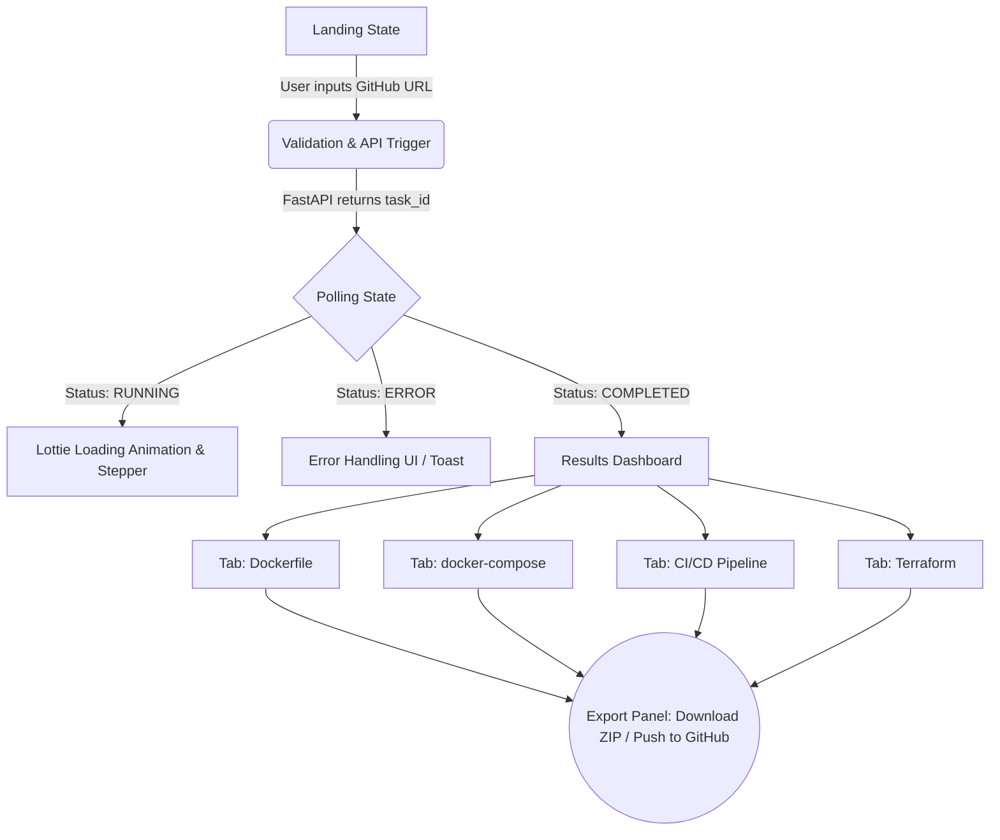

# CloudForge DevOps - Frontend Architecture Design

This document outlines the frontend architecture for CloudForge DevOps. It prioritizes a high-speed MVP using **Streamlit** while laying the conceptual groundwork for a seamless migration to a **React.js (Next.js)** SPA in the future.

---

## 1. UI Architecture & Page Flow

The application follows a linear, single-page dashboard flow to minimize friction for developers. 



---

## 2. Component Structure (Streamlit MVP)

Streamlit scripts run top-to-bottom, but we will maintain a modular React-like structure in the `frontend/` directory to keep the code clean.

*   `app.py`: The main orchestration file. It reads state and decides which components to render.
*   `components/sidebar.py`: Contains API keys, Cloud provider selection (AWS/GCP), and theme toggles.
*   `components/url_input.py`: A stylized search-bar component for the GitHub URL.
*   `components/status_stepper.py`: Visual indicator showing steps: *1. Cloning -> 2. AI Scanning -> 3. Generating Code -> 4. Finalizing.*
*   `components/code_viewer.py`: Wraps the code editors inside `st.tabs()`.
*   `utils/api_client.py`: Centralized HTTP requests `requests.Session()` to interact with the FastAPI backend.

---

## 3. State Management Approach

### MVP Phase (Streamlit)
Streamlit re-runs the entire script on every user interaction (like clicking a button). We will rely heavily on `st.session_state` to prevent losing the generated files:
```python
# State Management Example
if 'task_id' not in st.session_state:
    st.session_state.task_id = None
if 'generated_assets' not in st.session_state:
    st.session_state.generated_assets = {}
if 'app_status' not in st.session_state:
    st.session_state.app_status = 'IDLE' # IDLE, POLLING, COMPLETED, ERROR
```

### Future Phase (React.js / Next.js)
*   **Global State**: **Zustand** (Lightweight, un-opinionated state manager for holding user auth and UI themes).
*   **Server State (Polling)**: **TanStack Query (React Query)**. It has built-in features for polling APIs on an interval (perfect for tracking the Celery worker status) and handles caching/retries automatically.

---

## 4. Recommended Libraries & UI Elements

### For the Streamlit MVP:
1.  **`streamlit-ace`** or **`streamlit-monaco`**: Replaces standard text blocks with an interactive code editor (like VS Code) so users can manually edit the AI-generated Dockerfiles before downloading.
2.  **`streamlit-lottie`**: For rendering beautiful, lightweight JSON-based loading animations while the LLM is generating code.
3.  **`st.toast` / `st.error`**: Native Streamlit components for graceful error handling (e.g., "Invalid GitHub URL" or "API Timeout").
4.  **Custom CSS (`assets/styles.css`)**: We will inject custom CSS using `st.markdown("<style>...</style>", unsafe_allow_html=True)` to hide Streamlit's default branding, round the corners (border-radius), and apply a modern "Glassmorphism" dark theme.

### For the React.js Future Upgrade:
1.  **Tailwind CSS + shadcn/ui**: For a highly professional, beautifully styled, and responsive component library (radix primitives).
2.  **Framer Motion**: For smooth page transitions and loading stepper animations.
3.  **Monaco Editor (`@monaco-editor/react`)**: The exact editor that powers VS Code, embedded in the browser.
4.  **JSZip & FileSaver.js**: For bundling the generated files into a ZIP archive entirely on the client side.
