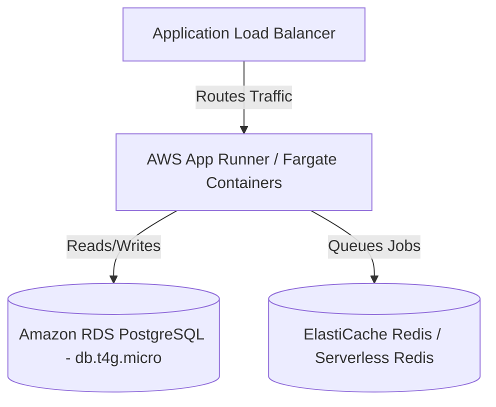

# Cloud Cost Optimization & Scalability Report

This document analyzes the generated AWS Terraform infrastructure (EC2 + S3) for **CloudForge DevOps**. It provides monthly cost estimations, optimization strategies, and alternative architectures tailored for a low-budget, startup-friendly, yet production-capable environment.

---

## 1. Current Architecture Cost Estimation

The current Terraform configuration deploys a monolithic Docker Compose stack (FastAPI, PostgreSQL, Redis) onto a single AWS EC2 instance (`t3.medium`).

| Resource | Specification | Estimated Monthly Cost (us-east-1) |
| :--- | :--- | :--- |
| **EC2 Compute** | `t3.medium` (2 vCPU, 4GB RAM) on-demand | ~$30.36 |
| **EBS Storage** | 30 GB `gp3` SSD (Root volume) | ~$2.40 |
| **S3 Storage** | 10 GB Standard Storage | ~$0.23 |
| **Data Transfer** | First 100 GB Outbound is free | $0.00 |
| **Total Estimated MVP Cost** | | **~$32.99 / month** |

> [!NOTE]
> This is a highly cost-effective setup for an MVP. By running the database, cache, and API on a single node, you avoid the high baseline costs of managed services like Amazon RDS (~$15-$30/mo minimum) and ElastiCache (~$12/mo minimum).

---

## 2. Immediate Cost & Performance Optimizations (AWS)

If you wish to lower the AWS bill further while maintaining or improving performance, implement these changes in your Terraform code:

### A. Instance Optimization: Switch to AWS Graviton (ARM64)
Switch the instance type from the Intel-based `t3.medium` to the custom-built AWS Graviton2 `t4g.medium`.
* **Why**: Graviton processors provide up to 40% better price performance.
* **Savings**: A `t4g.medium` costs ~$24.52/month, representing an immediate **~20% compute savings** with zero code changes (Docker builds natively support ARM).

### B. Storage Optimization: S3 Lifecycle Policies
Currently, every generated Dockerfile, Compose, and Terraform file sits in S3 Standard storage forever.
* **Action**: Add an `aws_s3_bucket_lifecycle_configuration` resource in Terraform.
* **Rule**: Move files older than 30 days to **S3 Intelligent-Tiering** or **S3 Glacier Instant Retrieval**, cutting long-term storage costs by up to 68%.

### C. Compute Commitments: AWS Compute Savings Plans
If you are confident in running the application for at least 1 year:
* **Action**: Purchase a 1-year No-Upfront Compute Savings Plan.
* **Savings**: This will drop the `t3.medium` cost from ~$30/mo to ~$21/mo (a ~30% discount).

---

## 3. Cheaper Cloud Alternatives

If $30/month is still too high for the MVP phase, consider migrating the Terraform provider to alternative infrastructure-as-a-service (IaaS) providers:

1. **Hetzner Cloud (Ultra Low Budget)**
   - An ARM-based CAX21 instance (4 vCPU, 8GB RAM) costs roughly **~$6.50 / month**.
   - *Trade-off*: Less managed ecosystem compared to AWS, but unmatched raw performance-per-dollar for Docker Compose setups.
2. **AWS Lightsail (Predictable Billing)**
   - Lightsail bundles compute, storage, and data transfer bandwidth. A 4GB RAM instance costs a flat **$20.00 / month**.
   - *Trade-off*: Harder to integrate with advanced AWS networking (VPCs) later on.
3. **DigitalOcean Droplets**
   - A 4GB RAM droplet costs **$24.00 / month**. Excellent developer experience and very startup-friendly.

---

## 4. Scaling Improvements (The "Next Step" Architecture)

While the single EC2 node is perfect for testing and early users, it presents a single point of failure. If the EC2 instance crashes, the API goes down, and you risk database corruption.

When you are ready to scale and have a budget of ~$100/month, transition to this architecture:

### The "Decoupled Serverless" Architecture

**Why this scales better:**
1. **Stateless Compute**: By moving the FastAPI containers to AWS App Runner or ECS Fargate, AWS automatically scales the containers horizontally based on CPU usage or concurrent requests. If traffic spikes, it spins up 5 containers. When traffic drops, it scales back down.
2. **Managed Database (RDS)**: Moving PostgreSQL off the EC2 instance into Amazon RDS provides automated daily backups, point-in-time recovery, and Multi-AZ failover. Your data is vastly more secure.
3. **Zero Downtime Deployments**: The Load Balancer allows your GitHub Actions CI/CD pipeline to deploy new Docker images without taking the application offline.
